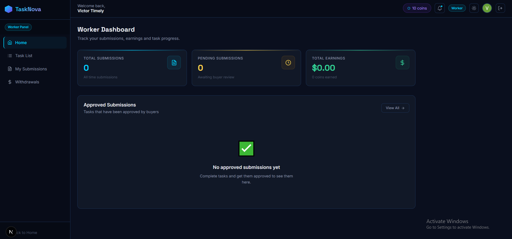
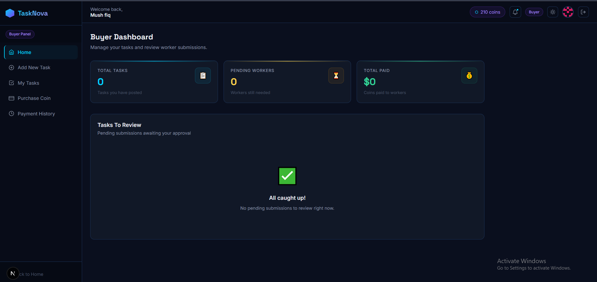
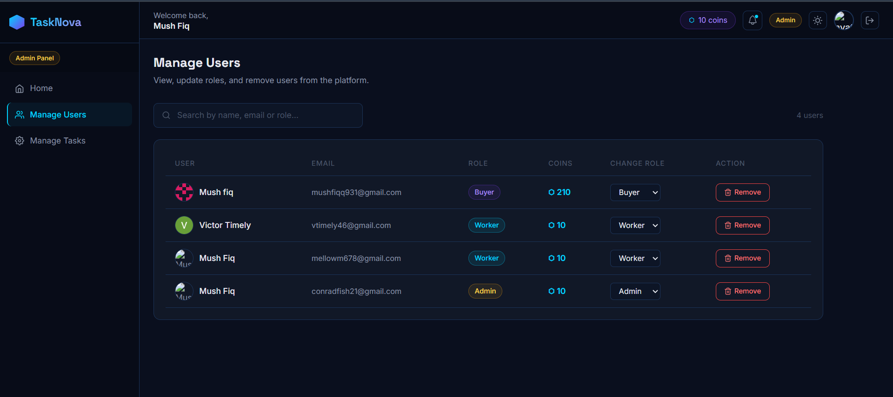
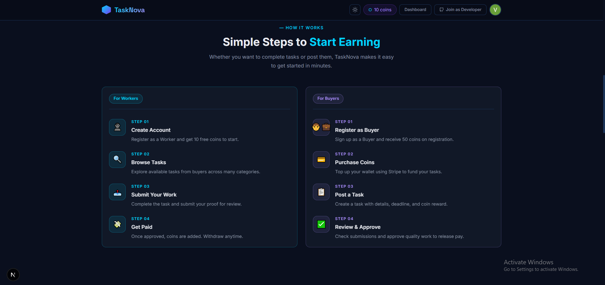

<div align="center">


</div>

<div align="center">

[](https://your-tasknova.vercel.app)
[](https://github.com/Mushfiq599/tasknova-client)
[](https://github.com/Mushfiq599/tasknova-server)
[](https://nextjs.org)
[](https://stripe.com)

</div>

---

## 📌 Project Overview

**TaskNova** is a full-stack micro-task and earning platform where **Buyers** post small tasks, **Workers** complete them to earn coins, and **Admins** oversee the entire ecosystem. The platform features a coin-based economy powered by **Stripe** payments, JWT-secured API routes, and a dark neon fintech design system with a theme toggle.

Built with **Next.js** on the frontend and a **Node.js/Express** REST API with **MongoDB** on the backend, TaskNova demonstrates a complete three-role user architecture with role-specific dashboards, protected routes, and real payment integration.

---

## 🖼️ Screenshots

> **Worker Dashboard**


> **Buyer Dashboard**


> **Admin Dashboard**


> **Task Details & Submission**


---

## ✨ Main Features

### 👷 Worker Features
- 🔍 Browse available tasks posted by Buyers
- 📝 Submit task proof/work for Buyer review
- 💰 Earn coins upon Buyer approval
- 📊 Personal dashboard — earnings, submission history, stats
- 💸 Withdraw earned coins to payment method

### 🧑‍💼 Buyer Features
- ➕ Create new tasks with title, description, required workers & coin reward
- 👀 Review Worker submissions — approve or reject with feedback
- 💳 Purchase coins via **Stripe** to fund tasks
- 📋 Manage all posted tasks — edit or delete
- 📈 Dashboard with task stats and spending overview

### 🛡️ Admin Features
- 👥 View and manage all users (Workers, Buyers)
- 🪙 Manually adjust user coin balances
- 📦 Manage all tasks on the platform
- 🔄 Handle withdrawal requests from Workers
- 📊 Full platform stats — total tasks, users, transactions

### 🌐 General
- 🔐 Firebase Authentication — email/password login
- 🔑 JWT tokens stored in HTTP-only cookies
- 🎭 Demo credentials for all three roles
- 🌙 Dark neon fintech theme with light/dark toggle
- 📱 Fully responsive across all devices
- 🔒 Role-based protected routes — each role sees only its dashboard

---

## 🛠️ Tech Stack

### Frontend
| Technology | Purpose |
|---|---|
| Next.js (App Router) | Framework, SSR, routing |
| Tailwind CSS | Styling and responsive design |
| Firebase Authentication | Email/password login |
| Axios | HTTP requests to backend API |
| Stripe.js | Payment UI integration |
| React Hot Toast | Notification system |
| React Icons | Icon library |

### Backend
| Technology | Purpose |
|---|---|
| Node.js | Runtime environment |
| Express.js | REST API framework |
| MongoDB | Database |
| JSON Web Token (JWT) | Secure API authorization |
| Cookie-parser | HTTP-only cookie handling |
| Stripe | Payment processing & coin purchase |
| CORS | Cross-origin resource sharing |
| dotenv | Environment variable management |

---

## 📦 Dependencies

### Frontend (`package.json`)
```json
{
  "dependencies": {
    "next": "^14.2.0",
    "react": "^18.3.1",
    "react-dom": "^18.3.1",
    "firebase": "^10.12.0",
    "axios": "^1.7.2",
    "@stripe/stripe-js": "^4.1.0",
    "@stripe/react-stripe-js": "^2.7.1",
    "react-hot-toast": "^2.4.1",
    "react-icons": "^5.2.1",
    "tailwindcss": "^3.4.4"
  }
}
```

### Backend (`package.json`)
```json
{
  "dependencies": {
    "express": "^4.19.2",
    "mongodb": "^6.7.0",
    "jsonwebtoken": "^9.0.2",
    "cookie-parser": "^1.4.6",
    "stripe": "^16.2.0",
    "cors": "^2.8.5",
    "dotenv": "^16.4.5"
  }
}
```

---

## ⚙️ Local Setup Guide

### Prerequisites
- Node.js v18+ installed
- MongoDB Atlas account (or local MongoDB)
- Firebase project created
- Stripe account (for payment testing)
- Git installed

---

### 1. Clone the repositories

```bash
# Clone frontend
git clone https://github.com/YOUR_USERNAME/tasknova-client.git
cd tasknova-client

# Clone backend (open a second terminal)
git clone https://github.com/YOUR_USERNAME/tasknova-server.git
cd tasknova-server
```

---

### 2. Backend setup

```bash
cd tasknova-server
npm install
```

Create a `.env` file in the backend root:

```env
PORT=5000
DB_USER=your_mongodb_username
DB_PASS=your_mongodb_password
ACCESS_TOKEN_SECRET=your_jwt_secret_key
STRIPE_SECRET_KEY=sk_test_your_stripe_secret_key
```

Start the backend server:

```bash
node index.js
```

Backend will run at: `http://localhost:5000`

---

### 3. Frontend setup

```bash
cd tasknova-client
npm install
```

Create a `.env.local` file in the frontend root:

```env
NEXT_PUBLIC_API_URL=http://localhost:5000
NEXT_PUBLIC_FIREBASE_API_KEY=your_firebase_api_key
NEXT_PUBLIC_FIREBASE_AUTH_DOMAIN=your_project.firebaseapp.com
NEXT_PUBLIC_FIREBASE_PROJECT_ID=your_project_id
NEXT_PUBLIC_FIREBASE_STORAGE_BUCKET=your_project.appspot.com
NEXT_PUBLIC_FIREBASE_MESSAGING_SENDER_ID=your_sender_id
NEXT_PUBLIC_FIREBASE_APP_ID=your_app_id
NEXT_PUBLIC_STRIPE_PUBLISHABLE_KEY=pk_test_your_stripe_publishable_key
```

Start the frontend:

```bash
npm run dev
```

Frontend will run at: `http://localhost:3000`

---

### 4. Stripe test card (for coin purchase testing)

| Field | Value |
|---|---|
| Card number | `4242 4242 4242 4242` |
| Expiry | Any future date |
| CVC | Any 3 digits |
| ZIP | Any 5 digits |

---

### 5. Demo credentials (for testing all roles)

| Role | Email | Password |
|---|---|---|
| Admin | demoadmin@tasknova.com | DemoAdmin@123 |
| Buyer | demobuyer@tasknova.com| DemoBuyer@123 |
| Worker | demoworker@tasknova.com| DemoWorker@123 |

*(Update these with your actual demo credentials)*

---

## 🌐 Live Link & Relevant Links

| Resource | Link |
|---|---|
| 🌐 Live Site | [your-tasknova.vercel.app](https://your-tasknova.vercel.app) |
| 💻 Frontend Repo | [github.com/Mushfiq599/tasknova-client](https://github.com/Mushfiq599/tasknova-client) |
| ⚙️ Backend Repo | [github.com/Mushfiq599/tasknova-server](https://github.com/Mushfiq599/tasknova-server) |
| 💳 Stripe Docs | [stripe.com/docs](https://stripe.com/docs) |
| 🔥 Firebase Console | [firebase.google.com](https://firebase.google.com) |
| 🍃 MongoDB Atlas | [mongodb.com/atlas](https://mongodb.com/atlas) |

---

<div align="center">


</div>
